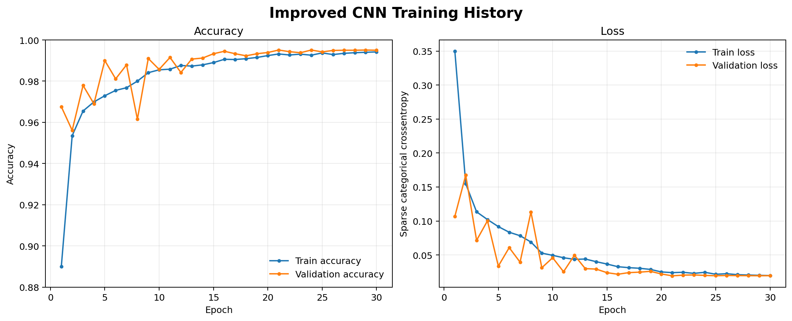
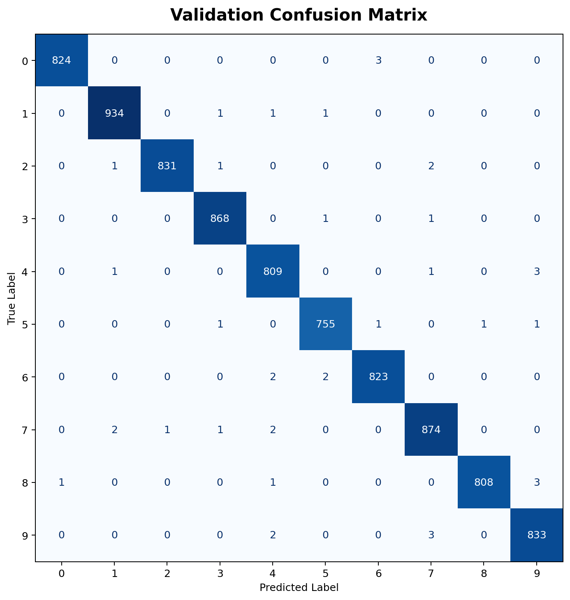
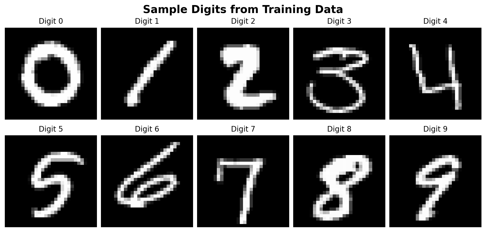
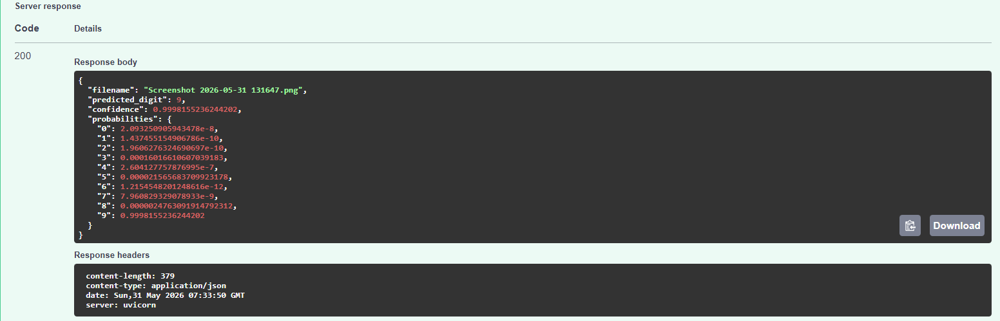
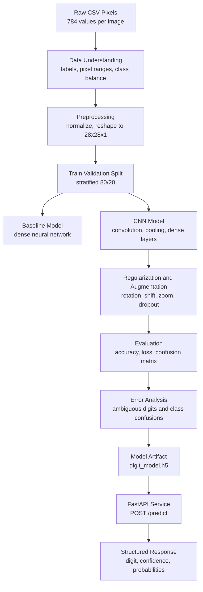
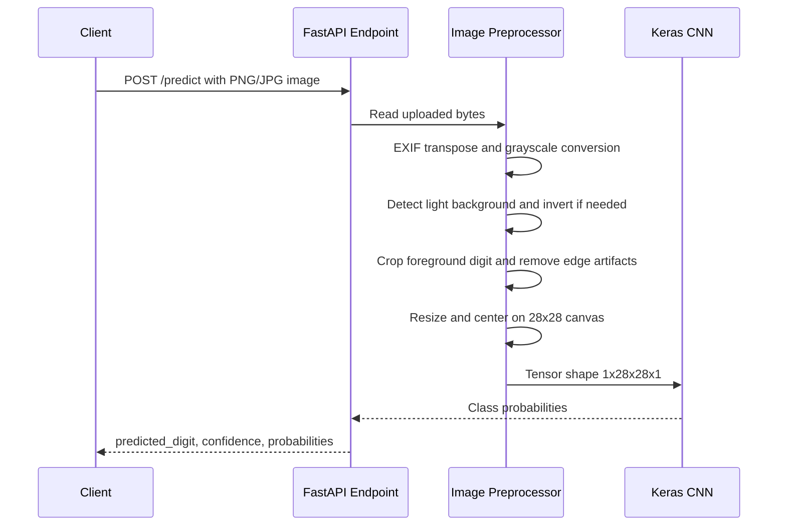
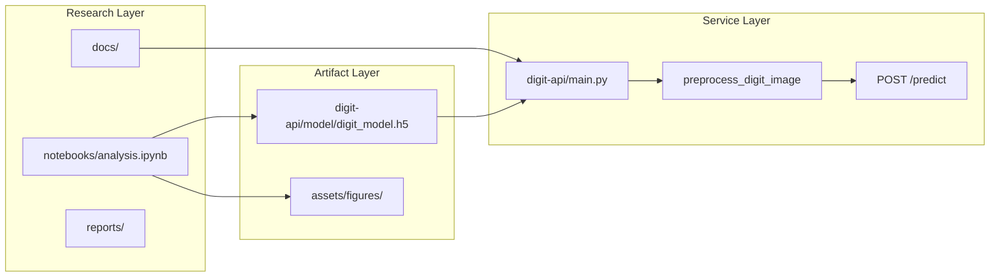
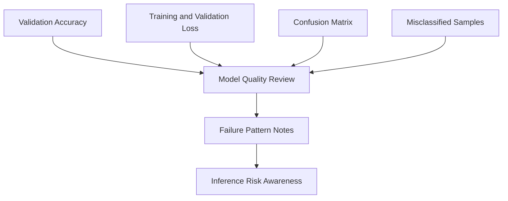

# Vision Classification Pipeline

<a id="readme-top"></a>


> End-to-end computer vision classification pipeline that turns raw pixel data into a trained CNN model, evaluation artifacts, and a FastAPI inference service.

This repository is built as a recruiter-grade machine learning engineering case study. The dataset is intentionally simple, but the work is framed like a production workflow: define the problem, prepare raw image tensors, train and compare models, evaluate failure patterns, package inference, and expose predictions through an API.

**Project Link:** [github.com/mutassimalzeem/vision-classification-pipeline](https://github.com/mutassimalzeem/vision-classification-pipeline)

---

## Table of Contents

1. [Executive Summary](#executive-summary)
2. [Business Problem](#business-problem)
3. [Project Results](#project-results)
4. [Visual Evidence](#visual-evidence)
5. [System Architecture](#system-architecture)
6. [Inference API](#inference-api)
7. [Repository Structure](#repository-structure)
8. [Built With](#built-with)
9. [Getting Started](#getting-started)
10. [Usage](#usage)
11. [Evaluation Strategy](#evaluation-strategy)
12. [Roadmap](#roadmap)
13. [Portfolio Highlights](#portfolio-highlights)
14. [Acknowledgments](#acknowledgments)

---

## Executive Summary

Many real-world vision systems begin with a narrow recognition task: identify a mark, symbol, number, product state, form entry, or visual defect. This project uses handwritten digit recognition as a controlled environment for demonstrating the complete ML delivery lifecycle.

The core objective is not just "train a digit classifier." The objective is to show how a model moves from raw pixel data to an inference-ready product component.

| Area | Implementation |
|---|---|
| Problem type | Supervised multi-class image classification |
| Dataset | Kaggle Digit Recognizer, 28x28 grayscale digit images |
| Model family | TensorFlow/Keras CNN |
| Best validation result | 99.51% accuracy on an 8,400-image validation split |
| API | FastAPI `POST /predict` image upload endpoint |
| Output | Predicted digit, confidence score, class probabilities |
| Portfolio focus | ML lifecycle, evaluation, inference design, documentation |

<p align="right">(<a href="#readme-top">back to top</a>)</p>

---

## Business Problem

Organizations often need lightweight image classification systems that can convert visual inputs into structured decisions. Examples include scanned forms, handwritten identifiers, simple quality-control marks, and digitized operational workflows.

This project models that pattern through a handwritten digit classifier:

- **Input:** raw image pixels or uploaded digit images
- **Processing:** normalization, reshaping, digit extraction, CNN inference
- **Output:** structured prediction response suitable for downstream applications
- **Business value:** faster conversion of visual input into machine-readable labels

### Success Criteria

| Requirement | Why It Matters |
|---|---|
| Accurate digit classification | Proves the model learns useful visual structure |
| Consistent preprocessing | Prevents training-serving skew |
| Confusion matrix and error review | Shows where the model fails, not only where it succeeds |
| API contract | Makes the model usable outside a notebook |
| Reproducible documentation | Makes the project understandable to technical and non-technical reviewers |

<p align="right">(<a href="#readme-top">back to top</a>)</p>

---

## Project Results

| Metric | Value |
|---|---:|
| Validation images | 8,400 |
| Correct validation predictions | 8,359 |
| Validation errors | 41 |
| Validation accuracy | 99.51% |
| API test image prediction | Digit `9` |
| API test confidence | 99.98% |

The saved CNN model performs strongly on the validation split and has been tested through the live FastAPI endpoint using a custom uploaded image.

<p align="right">(<a href="#readme-top">back to top</a>)</p>

---

## Visual Evidence

### Training History



The final CNN converges cleanly, with validation accuracy stabilizing near the top of the range and validation loss remaining low.

### Confusion Matrix



The confusion matrix shows a strong diagonal, which means the model is correctly separating most digit classes. Remaining errors are concentrated in visually similar handwriting patterns.

### Training Samples



The training data consists of grayscale 28x28 digit images represented as flattened pixel values in the original CSV dataset.

### API Prediction Demo



The API returns a structured prediction response with a digit label, confidence score, and full probability distribution.

<p align="right">(<a href="#readme-top">back to top</a>)</p>

---

## System Architecture

### End-to-End ML Workflow



### Inference Flow



### Model Delivery Layers



<p align="right">(<a href="#readme-top">back to top</a>)</p>

---

## Inference API

The project includes a FastAPI service that loads the saved Keras model and exposes prediction through an image upload endpoint.

### Endpoint

```text
POST /predict
```

### Request

```bash
curl -X POST "http://127.0.0.1:8000/predict" \
  -H "accept: application/json" \
  -H "Content-Type: multipart/form-data" \
  -F "file=@digit.png;type=image/png"
```

### Response

```json
{
  "filename": "digit.png",
  "predicted_digit": 9,
  "confidence": 0.9998,
  "probabilities": {
    "0": 0.0000,
    "1": 0.0000,
    "2": 0.0000,
    "3": 0.0001,
    "4": 0.0000,
    "5": 0.0000,
    "6": 0.0000,
    "7": 0.0000,
    "8": 0.0000,
    "9": 0.9998
  }
}
```

### Production-Oriented Preprocessing

The API preprocessing handles more than a naive resize:

- Converts uploaded images to grayscale
- Handles transparent images by compositing on white
- Detects light backgrounds and inverts to MNIST-like polarity
- Removes edge artifacts from screenshots
- Crops the visible digit instead of the whole canvas
- Resizes proportionally and centers on a 28x28 canvas
- Returns clear `400` errors for unreadable or blank inputs

<p align="right">(<a href="#readme-top">back to top</a>)</p>

---

## Repository Structure

```text
vision-classification-pipeline/
|
|-- README.md
|-- PROJECT_CHARTER.md
|-- ROADMAP.md
|-- requirements.txt
|
|-- digit-api/
|   |-- main.py
|   |-- requirements.txt
|   `-- model/
|       |-- main.py
|       `-- digit_model.h5
|
|-- src/
|   |-- train.csv
|   |-- test.csv
|   `-- sample_submission.csv
|
|-- notebooks/
|   |-- analysis.ipynb
|   `-- model.png
|
|-- assets/
|   |-- figures/
|   |   |-- training-history.png
|   |   |-- confusion-matrix.png
|   |   `-- sample-digits.png
|   `-- screenshots/
|       |-- prediction-demo.png
|       |-- swagger-ui.png
|       `-- test_image.png
|
|-- docs/
|   |-- 01_problem_framing/
|   |-- 02_data_understanding/
|   |-- 03_experiment_design/
|   |-- 04_modeling_strategy/
|   |-- 05_evaluation/
|   |-- 06_inference_api/
|   |-- 07_deployment/
|   `-- 08_portfolio_case_study/
|
`-- reports/
    |-- experiment_logs/
    `-- model_cards/
```

### Why The Repo Is Structured This Way

| Folder | Purpose |
|---|---|
| `digit-api/` | Deployable inference service and saved model artifact |
| `src/` | Raw Kaggle Digit Recognizer CSV files |
| `notebooks/` | Experimentation, model training, and analysis |
| `docs/` | ML planning, evaluation, deployment, and portfolio documentation |
| `assets/` | Visual evidence for reviewers and recruiters |
| `reports/` | Model-card and experiment-log templates |

<p align="right">(<a href="#readme-top">back to top</a>)</p>

---

## Built With

- [Python](https://www.python.org/)
- [TensorFlow / Keras](https://www.tensorflow.org/)
- [FastAPI](https://fastapi.tiangolo.com/)
- [NumPy](https://numpy.org/)
- [Pandas](https://pandas.pydata.org/)
- [scikit-learn](https://scikit-learn.org/)
- [Matplotlib](https://matplotlib.org/)
- [Pillow](https://python-pillow.org/)
- [Uvicorn](https://www.uvicorn.org/)

<p align="right">(<a href="#readme-top">back to top</a>)</p>

---

## Getting Started

### Prerequisites

- Python 3.10 or newer
- Git
- Recommended: virtual environment

### Installation

1. Clone the repository.

```bash
git clone https://github.com/mutassimalzeem/vision-classification-pipeline.git
cd vision-classification-pipeline
```

2. Create and activate a virtual environment.

```bash
python -m venv .venv
.venv\Scripts\activate
```

3. Install dependencies.

```bash
pip install -r requirements.txt
pip install -r digit-api/requirements.txt
```

4. Confirm the model artifact exists.

```text
digit-api/model/digit_model.h5
```

<p align="right">(<a href="#readme-top">back to top</a>)</p>

---

## Usage

### Run The API

```bash
cd digit-api
python -m uvicorn main:app --host 127.0.0.1 --port 8000
```

Open the interactive API documentation:

```text
http://127.0.0.1:8000/docs
```

### Make A Prediction

```bash
curl -X POST "http://127.0.0.1:8000/predict" \
  -H "accept: application/json" \
  -H "Content-Type: multipart/form-data" \
  -F "file=@path/to/digit.png;type=image/png"
```

### Reproduce Analysis

Open the notebook:

```text
notebooks/analysis.ipynb
```

The notebook covers data loading, preprocessing, train-validation split, model training, evaluation, confusion matrix generation, and final model export.

<p align="right">(<a href="#readme-top">back to top</a>)</p>

---

## Evaluation Strategy

This project evaluates model quality beyond one accuracy number.



### What Was Reviewed

- Whether validation accuracy improved across model iterations
- Whether training and validation curves suggested overfitting
- Which digit pairs were confused most often
- Whether errors came from ambiguous handwriting or preprocessing mismatch
- Whether real uploaded images matched the model's expected training format

### Key Learning

The most important deployment lesson was training-serving consistency. The original API used a simple grayscale resize, which caused custom colored images to be misread. The endpoint now uses digit extraction, polarity normalization, edge cleanup, and centered 28x28 formatting to better match the training distribution.

<p align="right">(<a href="#readme-top">back to top</a>)</p>

---

## Roadmap

- [x] Define business-style ML problem framing
- [x] Prepare raw pixel data for CNN modeling
- [x] Train baseline and improved CNN models
- [x] Generate training-history and confusion-matrix visuals
- [x] Package saved Keras model
- [x] Build FastAPI prediction endpoint
- [x] Add preprocessing for custom uploaded images
- [ ] Add automated API tests
- [ ] Add model version metadata to API responses
- [ ] Add confidence threshold warnings
- [ ] Deploy the API to a cloud service
- [ ] Add a lightweight drawing-canvas frontend

<p align="right">(<a href="#readme-top">back to top</a>)</p>

---

## Portfolio Highlights

This repository demonstrates practical ML engineering skills that transfer beyond digit recognition:

- **Problem framing:** explains why a simple dataset can still demonstrate a real ML workflow
- **Data preparation:** converts flattened pixel columns into model-ready image tensors
- **Modeling:** compares baseline, CNN, augmented, and improved approaches
- **Evaluation:** uses visual and quantitative diagnostics
- **Inference engineering:** turns a notebook-trained model into an API service
- **Debugging:** fixes real custom-image prediction failures caused by preprocessing mismatch
- **Documentation:** presents the project as a business-relevant case study

<p align="right">(<a href="#readme-top">back to top</a>)</p>

---

## Acknowledgments

- Kaggle Digit Recognizer dataset for the raw digit classification problem
- Best-README-Template for README organization inspiration
- TensorFlow/Keras and FastAPI documentation for model and API implementation patterns

<p align="right">(<a href="#readme-top">back to top</a>)</p>
