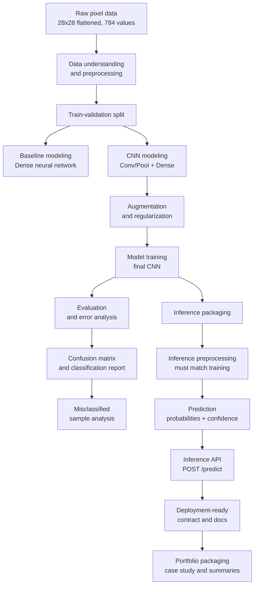

# Vision Classification Pipeline from Raw Pixels to Deployment-Ready Inference API

> A documentation-first computer vision project using Kaggle Digit Recognizer to build an end-to-end image classification pipeline with preprocessing, CNN modeling, augmentation, evaluation, error analysis, and deployment-ready inference planning.

## Project Positioning

This is **not** presented as “MNIST solved.”

This project is framed as:

> **A complete computer vision classification pipeline that transforms raw pixel data into a trained, evaluated, and deployment-ready inference system.**

The goal is to demonstrate practical ML engineering thinking:

- raw image data preparation
- image preprocessing pipeline design
- CNN baseline development
- augmentation and regularization strategy
- experiment tracking mindset
- model evaluation beyond accuracy
- confusion matrix and error analysis
- inference API design
- deployment-readiness documentation
- portfolio-level case study writing

## Dataset

Competition: **Kaggle Digit Recognizer**

The dataset contains grayscale handwritten digit images represented as flattened pixel values. Each image is originally 28×28 pixels and belongs to one of 10 classes: digits 0 through 9.

## Business-Style Problem Statement

Many real-world vision systems begin with simple classification problems: identifying a visual object, symbol, defect, handwritten input, or scanned mark. This project treats handwritten digit recognition as a controlled environment for building the full machine learning lifecycle around a vision classification task.

Instead of only optimizing accuracy, this project focuses on the complete engineering workflow required to make a vision model understandable, reproducible, evaluable, and ready for inference.

## Core Objectives

1. Convert raw pixel data into image tensors.
2. Build a baseline classifier.
3. Build and improve a CNN model.
4. Apply augmentation and regularization.
5. Evaluate using accuracy, confusion matrix, classification report, and misclassification analysis.
6. Save the final model.
7. Design an inference API.
8. Document the complete system as a portfolio-ready case study.

## System Architecture (End-to-End Pipeline)




## Repository Structure

```text
vision-classification-pipeline/
│
├── README.md
├── PROJECT_CHARTER.md
├── ROADMAP.md
├── requirements.txt
├── .gitignore
│
├── docs/
│   ├── 01_problem_framing/
│   │   ├── problem_statement.md
│   │   ├── project_scope.md
│   │   └── success_criteria.md
│   │
│   ├── 02_data_understanding/
│   │   ├── dataset_card.md
│   │   ├── data_dictionary.md
│   │   └── preprocessing_plan.md
│   │
│   ├── 03_experiment_design/
│   │   ├── experiment_plan.md
│   │   ├── experiment_tracking_template.md
│   │   └── validation_strategy.md
│   │
│   ├── 04_modeling_strategy/
│   │   ├── baseline_model_plan.md
│   │   ├── cnn_model_plan.md
│   │   └── augmentation_regularization_plan.md
│   │
│   ├── 05_evaluation/
│   │   ├── evaluation_plan.md
│   │   ├── confusion_matrix_analysis.md
│   │   └── error_analysis_guide.md
│   │
│   ├── 06_inference_api/
│   │   ├── inference_pipeline_design.md
│   │   ├── api_contract.md
│   │   └── input_validation_plan.md
│   │
│   ├── 07_deployment/
│   │   ├── deployment_plan.md
│   │   └── production_readiness_checklist.md
│   │
│   └── 08_portfolio_case_study/
│       ├── case_study.md
│       ├── linkedin_post.md
│       └── portfolio_summary.md
│
├── notebooks/
│   └── README.md
│
├── src/
│   └── README.md
│
├── assets/
│   ├── figures/
│   │   └── README.md
│   └── screenshots/
│       └── README.md
│
└── reports/
    ├── experiment_logs/
    │   └── README.md
    └── model_cards/
        └── model_card_template.md
```

## Planned Phases

| Phase | Focus | Deliverable |
|---|---|---|
| 01 | Problem framing | Project charter and success criteria |
| 02 | Data understanding | Dataset card and preprocessing plan |
| 03 | Baseline modeling | Dense neural network baseline |
| 04 | CNN modeling | CNN architecture and training plan |
| 05 | Augmentation | Regularized CNN experiment |
| 06 | Evaluation | Confusion matrix and error analysis |
| 07 | Inference | Model loading and prediction design |
| 08 | API design | FastAPI inference contract |
| 09 | Portfolio packaging | Final case study and LinkedIn post |

## Project Story

This project uses a beginner-friendly dataset to demonstrate a professional workflow. The dataset is simple, but the process is not treated casually. Every step is documented as if this model were being prepared for a real product pipeline.

## Final Deliverable

The final result should include:

- trained CNN model
- clear evaluation report
- confusion matrix
- misclassified image analysis
- saved model artifact
- inference script
- FastAPI prediction endpoint
- model card
- case study README
- portfolio summary
